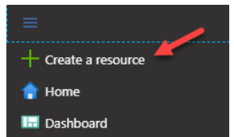
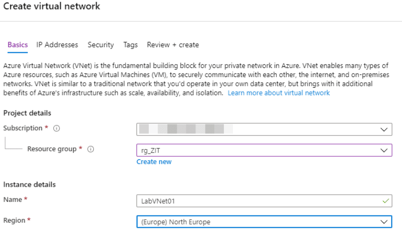
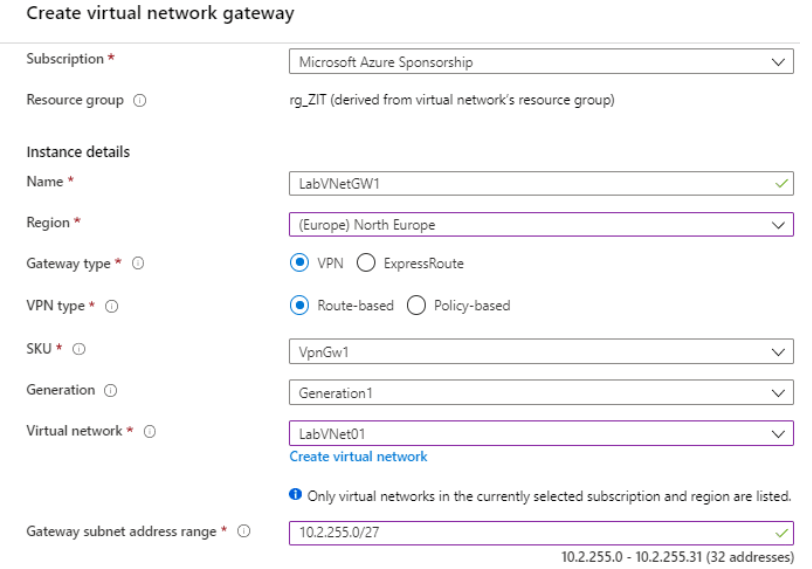
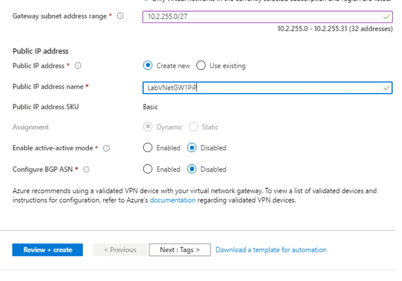

# 🔐 Azure Site-to-Site VPN with Routing and Remote Access (RRAS) on Hyper-V

> 📌 Goal: Establish a **Site-to-Site (S2S) VPN** connection between **Azure** and your **on-premises Hyper-V RRAS server** using **IKEv2/IPSec**.

---

## 📁 Prerequisites

| Requirement                          | Details                                                  |
|--------------------------------------|----------------------------------------------------------|
| Azure Subscription                   | With permission to create VNet, VPN Gateway, etc.        |
| Windows Server (Hyper-V VM)          | Running RRAS (Routing and Remote Access Service)         |
| Static Public IP (on-premises)       | Or NAT with port forwarding for UDP 500/4500             |
| Local network address space          | e.g., `192.168.10.0/24`                                  |
| Azure VNet Address Space             | e.g., `10.10.0.0/16`                                     |
| VPN Device (RRAS)                    | Supports IKEv2                                           |

---

## 🏗️ Step-by-Step Setup

---

### ☁️ 1. **Azure – Virtual Network Setup**

**1.1 Create a Virtual Network**
- Address space: `10.10.0.0/16`
- Subnet: `10.10.1.0/24`

**1.2 Add a Gateway Subnet**
- Name: `GatewaySubnet`
- Address range: e.g., `10.10.255.0/27`





---

### ☁️ 2. **Azure – VPN Gateway**

**2.1 Create Public IP**
- Name: `vpn-public-ip`
- SKU: Basic or Standard

**2.2 Create Virtual Network Gateway**
- Name: `vnet-gateway`
- VPN type: Route-based
- Generation: VpnGw1 (or Basic)
- Attach `vpn-public-ip` created above
- Associate with the VNet

⏳ Deployment takes ~30–45 minutes.




---

### ☁️ 3. **Azure – Local Network Gateway**

- Name: `onprem-lng`
- IP address: Public IP of your on-prem RRAS server
- Address space: `192.168.10.0/24` (or your on-prem subnet)

---

### ☁️ 4. **Azure – VPN Connection**

- Go to `vnet-gateway` → Connections → Add
- Name: `s2s-rras-connection`
- Connection type: Site-to-site (IPSec)
- Shared Key: e.g., `AzureSharedSecret123!`
- Select your Local Network Gateway

📸 *Add screenshot of Connection settings*

---

### 🖥️ 5. **On-Prem (Hyper-V) – RRAS Setup**

#### 5.1 Install RRAS Role
Via PowerShell:
```powershell
Install-WindowsFeature RemoteAccess -IncludeManagementTools
Install-WindowsFeature Routing
```

Or:
- Server Manager → Add Roles → **Remote Access** → Select **Routing**

---

#### 5.2 Configure RRAS
- Open RRAS console → Right-click server → Configure and Enable RRAS
- Choose: **Custom configuration**
- Select: **VPN Access** and **NAT**
- Finish wizard and start the RRAS service

📸 *Screenshot: RRAS Wizard options*

---

#### 5.3 Create Demand-Dial Interface

1. RRAS → Network Interfaces → New Demand-Dial Interface  
2. Name: `AzureVPN`  
3. Type: VPN → Protocol: **IKEv2**  
4. Destination: Azure VPN Gateway Public IP  
5. Credentials: Leave blank  
6. Use **Pre-shared key** (must match Azure)

📸 *Screenshot: Demand-Dial setup*

---

#### 5.4 Add Static Route to Azure
In RRAS:
- IPv4 → Static Routes → Add
- Destination: `10.10.0.0`
- Subnet Mask: `255.255.0.0`
- Interface: `AzureVPN`

---

#### 5.5 Set up NAT
- Right-click NAT → New Interface → Select your LAN NIC
- Enable NAT on internal interface

---

### 🔁 6. **Test & Verify Connection**

#### ✅ From Azure:
- Go to VPN Gateway → Connections → Status: `Connected`

#### ✅ From On-Prem RRAS:
- Demand-Dial Interfaces → Right-click `AzureVPN` → Connect
- `Status` should show `Connected`

#### ✅ Ping Test:
```powershell
ping 10.10.1.x  (Azure VM IP)
```

📸 *Screenshot: Successful connection in Azure*

---

## 🛠️ Troubleshooting

| Issue | Fix |
|-------|-----|
| VPN status shows **Disconnected** in Azure | Check shared key, firewall ports (UDP 500/4500) |
| Cannot ping Azure | Ensure route to Azure is configured in RRAS |
| Connection drops | Use static public IP for RRAS, enable keep-alive |

---
